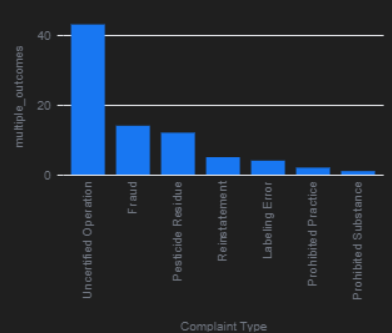
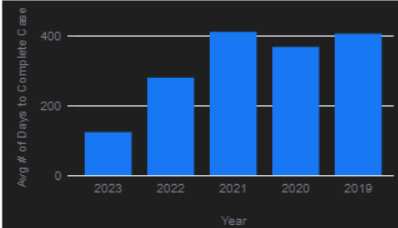
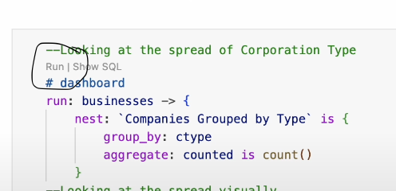

# USDA Organic Program Enforcement Analysis 

This repository contains data obtained by the [Data Liberation Project](https://www.data-liberation-project.org/), via a [Freedom of Information Act request] (https://www.data-liberation-project.org/datasets/usda-organic-program-enforcement/) to the US Department of Agriculture’s National Organic Program and pre-processed by the Data Liberation Project. 

## FOIA Records

The records provided by the US Department of Agriculture’s National Organic Program can be viewed [HERE](https://docs.google.com/spreadsheets/d/1gHNKxVObWfm1Q1JzkhDl8Wx4wKIPU-Wp/edit?gid=1251061210#gid=1251061210).

## Code 

This repository contains one Malloy code file: :

- [`US_Organic_Program_Enforcement.malloynb`](US_Organic_Program_Enforcement.malloynb), performs the analysis of the data provided by the Data Liberation Project. 

## Description of Project
Per the Data Liberation Project website, "The US Department of Agriculture's National Organic Program launched the COMPLIANCE Database...The tool allows the organization to better track case progress and more quickly identify patterns and relationships across complaints."

This project discusses different trends across the origins of investigations and outcomes. Ultimately, we utilize Malloy to understand the US Department of Agriculture's Compliance Database. Once analysts understand the database, we evaluate year-over-year trends and the overall effectiveness of the US Agriculture Department's investigative team so that decision-makers can be better informed about this organization.

## Motivation 

Within agriculture, there is always a looming pressure to perform well. With the added pressure comes the risk of fraud and other misconduct among those in the agricultural sphere. According to the United States Department of Agriculture website, the department has been a part of many intense and intricate investigations that you can read more about [HERE](https://www.rma.usda.gov/about-rma/department-justice-prosecutions). The purpose of this analysis was to find trends in the different investigations that had occurred under this United States Department's purview. 

## Data cleaning steps
Although the data was relatively clean, a few data-cleaning steps needed to occur for the program to run the code; for example, the Date/Time Open and Closed columns had to be converted to a better format for users. The collected amount column displayed civil penalties that needed commas and dollar signs to be recognized. However, Malloy could not read the dollar signs and commas, so new dimensions were required to fix this issue. Days and years in the dataset also needed extra dimensions for higher-level analysis. 

## Summary of Findings

Much like deep sea divers uncovering lost treasure in the ocean, as analysts, we also must discover the truth hiding beneath the waves of a sea of data. While going through this dataset, we will uncover some interesting findings that help us understand the bigger picture of what is happening in US agriculture. 

While going through the data, we will find that some organizations have a propensity for repeated investigations of illegal agricultural practices.

We will also find that specific civil cases result in fines ranging from a few hundred to several thousand dollars.

The target of the analysis will ultimately be to discover if the US Department of Agriculture has been having an acceptable amount of fraud discovered or if decision-makers at the government level need to re-evaluate the effectiveness of this organization's investigatory skills. 

Please note that this file is meant for users to manipulate the data in Visual Studio Code using Malloy. The descriptions of the sample visualizations below are simply meant as a brief demonstration of aspects that will be seen later in the data. 

Please see below for a sample of screenshots of visualizations that will be shown in the analysis: 

The "Organizations Investigated Repeatedly" visualization displays a trend of the organizations that had multiple investigations so they could be put on a future watch list if needed. As you can see, the National Organic Program had nine investigations from 2019-2023. Since the other closest organizations with multiple investigations had three, we will likely want to recommend that the US Department of Agriculture keep a close eye on the National Organic Program moving forward.   

The visualization below shows if there is a trend with multiple different outcomes occurring during one investigation. As we can see from the data, accusations of uncertified operations far outweigh other accusations with various outcomes. About 43 cases of uncertified operations have multiple outcomes that occurred with fraud being the next closest having 14 cases falling under that category. The analysis shows us that if the US Department of Agriculture accuses an organization of having uncertified operations, they are more likely to find some settlement in court or even have charges dropped entirely at the end of the proceedings.  
  

`Negative Outcomes Over the Five Year Range`:The “USDA Organic Program Enforcement Negative Outcomes Over Five Year Range” visualization is meant to see if situations, such as fraud, occurred frequently from 2019 until 2023. As we can see, there were certainly more cases in 2019 and 2021. The influx during these years is likely due to the US Department of Agriculture opening its investigative task force relatively recently in 2019 and possible pressures on agricultural organizations due to COVID conditions.  

The “USDA Organic Program Enforcement Case Length Versus Punishment Correlation” visualization is meant to see if there is a trend between cases being open longer and more severe punishments to the agricultural organizations under scrutiny. We can see cases that lasted longer in 2019 and 2021 which appear to correlate with the previous visualization and uphold the hypothesis that cases that last longer typically lead to situations such as fraud being the outcome of the investigation.  |  

The “USDA Organic Program Enforcement Government Department Effectiveness” is a high-level visualization meant to show if the government body is catching more cases of fraud than those not violating the law. After all the purpose is to find those who are not compliant rather than the alternative. This visualization requires users to download the Malloy.nb file to fully understand all the moving parts. However, briefly, this chart shows us that generally, the US Department of Agriculture appears to find more cases of compliance than fraud. This leaves us wondering if resources are being allocated correctly in this US Department or if this is an acceptable outcome to the investigatory proceedings.  | 

## Description of how others can build off of this work

Others can build off this work in various ways. Data analysts could use the trends in this project to forecast estimated future cases for the US Department of Agriculture. Decision makers at a government level could use the information to improve the effectiveness of this US Department. Finally, the general public could build off this work by applying more measures and dimensions to clarify understanding of the compliance dataset. 

## Directions on how to use the github web editor to run the same analysis

Are you logged into github? Just press the period key right now. This will load the web editor. Then install the malloy extension. See images below for reference:
| **Step**   | **Image Preview** |
|--------|-----------|
| `Step 1 - Press allow` |  |
| `Step 2 - Click the Blocks, search for Malloy, install` |  |
| `Step 3 - Click Trust` |  |
| `Step 4 - Click a .malloynb file` |  |
| `Step 5 - Press Run` |  |

## Licensing

The files provided directly via FOIA (see listing above) are, as government documents, now in the public domain. All other data files have been generated by Josh Hyer for Gonzaga University Graduate School of Business as part of the MSBA-622-01 Data Science for Business (Spring 2025) course and are available under Creative Commons’ [CC BY-SA 4.0 license terms](https://creativecommons.org/licenses/by-sa/4.0/). This repository’s code is available under the [MIT License terms](https://opensource.org/license/mit/). 
